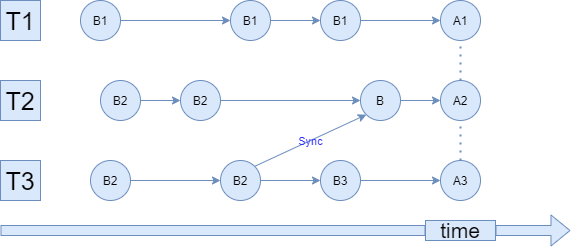

# Билет 5. Многопоточность и сети

* Использование  `boost::asio::ip::tcp::iostream`  на сервере и на клиенте, отличия  `local_endpoint()`  от  `remote_endpoint()`.
  - `boost::asio::ip::tcp::iostream`- поток ввода/вывода, который можно получить как сервер, либо же как клиент, подключившись к какому-то серверу. Как это делается:
	  - Сервер:
		  ``` c++
		using boost::asio::ip::tcp;

		int main(int argc, char *argv[]) {
				assert(argc == 2); 
				boost::asio::io_context io_context;
				tcp::acceptor acceptor(io_context, tcp::endpoint(tcp::v4(), std::atoi(argv[1])));
				std::cout << "Listening at " << acceptor.local_endpoint() << "\n"; //отладочный вывод
				tcp::iostream client([&]() {
					tcp::socket s = acceptor.accept();
					std::cout << "Connected " << s.remote_endpoint() << " --> " << s.local_endpoint() << "\n";
					return s;
				}());
			
				while (client) {
					std::string s;
					client >> s;
					client << "string: " << s << "\n";
				}
				std::cout << "Completed\n";
				return 0;
				}
		```
		Обо всем по порядку.
		- `boost::asio::io_context io_context`- просто вспомогательная переменная, которая инициализирует системную библиотеку.
		- 	`tcp::acceptor acceptor` - с помощью этой переменной, сервер понимает где нужно слушать подключения клиентов. Параметр `tcp::v4()` - означает, что нужно слушать на всех ip-адресах, а `std::atoi(argv[1])` - обозначает номер порта (происходит явный каст от аски-строки в инт), на котором надо слушать.
		- `tcp::iostream client` - тут мы как раз вызывает конструктор нужного нам `tcp::iostream`, внутрь которого мы передаем лямбду. В ней мы вызываем `acceptor.accept()` - блокируется, и ждет нового подключения, после подключения возвращает сокет, соответствующий клиенту,  который мы и возвращаем из лямбды.
		- В цикле `while` (пока клиент подключен) мы просто используем `tcp::iostream` как обычный поток ввода/вывода.
	- Клиент:
		``` c++
		using boost::asio::ip::tcp;
		
		int main(int argc, char *argv[]) {
			assert(argc == 3);
			boost::asio::io_context io_context;
			auto create_connection = [&]() {
			tcp::socket s(io_context);
			boost::asio::connect(
				s,
				tcp::resolver(io_context).resolve(argv[1], argv[2]));
				return tcp::iostream(std::move(s));
			};
			tcp::iostream conn = create_connection();
			std::cout << "Connected " << conn.socket().local_endpoint() << " --> " << conn.socket().remote_endpoint() << "\n";
			
			conn << "hello world 123\n";
			conn.socket().shutdown(tcp::socket::shutdown_send);
			std::cout << "Shut down\n";
			
			int c;
			while ((c = conn.get()) != std::char_traits<char>::eof()) {
				std::cout << static_cast<char>(c);
			}
			std::cout << "Completed\n";
			return 0;
		}
		```
		Отметим отличия от сервера:
		- `tcp::resolver(io_context).resolve(argv[1], argv[2])` - подключает сокет к такому адресу и порту.
		- `conn.socket().shutdown(tcp::socket::shutdown_send);` - дает понять серверу, что больше мы ничего отправлять не будем.
		
  - `local_endpoint()` - порт, на котором установили соединение, а `remote_endpoint()` -  порт, с которым установили соединение.		
* Создание потоков, передача аргументов в функцию потока, joinable/detached потоки
	- Виды создания потоков:
		- `std::thread` с использованием лямбды:
			```C++
			std::thread t([&]() {
				std::this_thread::sleep_for(std::chrono::milliseconds(500));
				std::cout << "Hello from thread! data=" << data << "\n";
				data += 10;
			});
			```
			Просто передаем лямбду в конструктор. `[&]` - означает, что передаем все видимые переменные по ссылке (то есть можем пользоваться ими внутри потока).
		- `std::thread` с явным указанием функции и ее параметров:
			```C++
			void worker(int a, int &b) {
				std::cout << "Thread: " << a << " " << &b << "\n";
			}
			.
			.
			.
			std::thread(worker, a, std::ref(b)).join();
			```
		Важно: всегда передаются копии параметров (если все-таки хотим передать ссылку, то надо )
	- Если `main` закончился раньше, чем какой-нибудь поток, то, строго говоря, будут происходить утечки, что не есть хорошо, с этим помогает `t.join()` - программа ждем, пока поток завершится, и освобождает его ресурсы.
	- `t.detach()` - Обещаем больше не делать join(), теперь ОС отвечает за сборку мусора в потоке. Возникает только если нам вообще ничего от потока `t` никогда не будет нужно. Единственный разумный пример: мы создаём сетевой сервер, который в бесконечном цикле плодит потоки для клиентов.
* Гонки: при выводе на экран, по данным, одновременное чтение.
	- Вывод на экран:
		```C++
		void writeln(const char *s) {
			for (int i = 0; s[i]; i++) {
				std::cout << s[i];
			}
			std::cout << '\n';
		}
		
		int main() {
			std::thread t([]() {
				for (;;) {
					writeln("Hello from the second thread");
				}
			});
			for (;;) {
				writeln("Hello from the main thread");
			}
			return 0;
		}
		```
		Гонка происходит не смотря на потокобезопасность `std::cout`, посколько функции вызываются независимо, а значит оба цикла могут работать одновременно.
	- По данным:
		```C++
		int data = 0;
			auto worker = [&data]() {
				for (int i = 0; i < N; i++) {
				data++;
			}
		};
		std::thread t(worker);
		for (int i = 0; i < M; i++) {
			if (data % 2 == 0) {
				std::cout << "data is " << data << " (in progress)\n";
			}
		}
		t.join();
		std::cout << "data is " << data << "\n";
		```
		В данном случае может произойти так, что выведется нечетное значение. Так происходит, потому что между проверкой и выводом, внутри потока (который захватил `data` по ссылке - может произойти изменение).


# Борьба с гонками: mutex, амомарные снимки, RAII-обёртка над мьютексом
### Mutex
`std::mutex` - переменная, которую можно захватывать и всего один поток может это сделать, а если попытается другой поток захватить, а её ещё не отпустили, то этот поток начинает её "ждать".

Простой пример:
```cpp
void function(const char *s) {
    std::mutex m;
    m.lock();
    for (int i = 0; s[i]; i++) {
        std::cout << s[i];
    }
    m.unlock();
}

WARNING: должен быть только один mutex!
ANSWER:
1. Сделать глобальной переменной
2. Сделать static переменной
```
---
### Aтомарные снимки:
Мотивация: ~~если вы волк~~ рассмотрим пример
```cpp
int data = 0;
auto worker = [&data]() {
    for (int i = 0; i < N; i++) {
        data++;
    }
};
std::thread t(worker);
for (int i = 0; i < M; i++) {
    if(data % 2 == 0){

        // нет никакой гарантии, что уже на этой строчке data % 2 == 0

        std::cout << "data is " << data << " (in progress)\n";
    }
}
t.join();
std::cout << "data is " << data << "\n";
```
### Снятие снимка - сохраняем знаничение в новую переменную и "шаманим" уже с ней
```cpp
for (int i = 0; i < M; i++) {
    data_snapshot = data;
    if(data_snapshot % 2 == 0){
        std::cout << "data is " << data_snapshot << " (in progress)\n";
    }
}
```
Запомнить: UB может происходить, когда один поток в переменую записывает, а другой пытается считать значение

Вот так хорошо:
```cpp
std::mutex m;
int data = 0;
auto worker = [&data, &m]() {
    for (int i = 0; i < N; i++) {
        std::unique_lock l{m};
        data++;
    }
};
std::thread t1(worker);
std::thread t2(worker);
for (int i = 0; i < M; i++) {
    std::unique_lock l(m);
    int data_snapshot = data;
    l.unlock();  // Не m.unlock()! Иначе unique_lock сделает unlock() ещё раз, это UB.

    if (data_snapshot % 2 == 0) {
        std::cout << "data is " << data_snapshot << " (in progress)\n";
    }
}
t2.join();
t1.join();
std::cout << "data is " << data << "\n";
```

### Атомарная операция - либо выполняется полностью, либо не выполняется вовсе

> Не пытаться использовать atomic, там жесть как только больше одной переменной (то есть почти всегда). (Егор Федорович)  
---
### RAII-обвёртка над std::mutex
`std::unique_lock` - захватывает `std::mutex` при создании и отпускает при удалении
```cpp
void function(const char *s) {
    std::unique_lock l{m};
    for (int i = 0; s[i]; i++) {
        std::cout << s[i];
    }
}

WARNING:
Нельзя писать std::unique_lock{m}; т.к. тогда объект уничтожается при ";"
```
---
## WARNING - за такое руки отрубают!
`std::this_thread::yield()` -  позволяет ОП самой давать возможность другим потокам работать
```cpp
std::thread t([]() {
    for (;;) {
        writeln("Hello from the second thread");
            // std::this_thread::yield();  // Костыль!
    }
});
```

`std::sleap` - лучше *****, но не бей. Очень люто, лишь делает вид, что всё работает!

---
# Reentrant-функции, recursive_mutex, deadlock, порядок взятие блокировок, избегание блокировок
### Reentrant-функции
Хотим вот так сделать:
```cpp
void foo(int x) {  // Атомарная операция, atomic.
    std::unique_lock l(m);
    std::cout << "foo(" << x << ")\n";
}

void double_foo(int x) {  // Неатомарная операция :(
    foo(x);
    foo(x + 1);
}

int main() {
    const int N = 100'000;
    std::thread t([]() {
        for (int i = 0; i < N; i += 10)
            double_foo(i);
    });
    for (int i = 0; i < N; i += 10)
        double_foo(N + i);
    t.join();
}
```
Не решения:
1) Если два раза взять mutex - нельзя, даже одному потоку, получим deadlock
2) Два mutex - не решило проблему, т.к. они mutex разные мы будем брать

Решения:
1) recursive_mutex - можно, даже будет работать, но 
   - замедляет выполнение программы 
   - сложнее работать 
   - плохой тон
2) Разделить функцию на две
```cpp
1)
std::mutex m;
void foo(int x) {  // Атомарная операция, atomic.
    std::unique_lock l(m);
    std::cout << "foo(" << x << ")\n";
}

void double_foo(int x) {
    std::unique_lock l(m); // deadlock
    foo(x);
    foo(x + 1);
}

2)
std::mutex m1,m2;
void foo(int x) {  // Атомарная операция, atomic.
    std::unique_lock l(m1);
    std::cout << "foo(" << x << ")\n";
}

void double_foo(int x) {
    std::unique_lock l(m2);
    foo(x);
    foo(x + 1);
}

3) код аналогичен 1-ому псевдо-решению
std::recursive_mutex m; 

4) 
// Приватный интерфейс.
void foo_lock_held(int x) {
    std::cout << "foo(" << x << ")\n";
}

// Публичный интерфейс из атомарных операций.
// Над ним надо очень хорошо думать, потому что комбинация двух атомарных операций неатомарна.
void foo(int x) {
    std::unique_lock l(m);
    foo_lock_held(x);
}

void double_foo(int x) {
    std::unique_lock l(m);
    foo_lock_held(x);
    foo_lock_held(x + 1);
} 
```
---
### recursive-mutex - в примере выше используется
---
### Deadlock - вечное ожидание
---
### Порядок взятия блокировок
~~Как-то раз Близнец произнёс: Представьте, что вы миллиардер!~~

Представьте, что вы банк, и у вас целых 2 несчастных бабушки, которые делают 1000 транзакций в секунду (а если счастливая бабушка, которая учится на ПМИ, то и 1-ой транзакции хватит), тогда может быть проблемка с взятием mutex:
```cpp
std::mutex m1, m2;
std::thread t1([&]() {
    for (int i = 0; i < N; i++) {
        std::unique_lock a(m1);
        std::unique_lock b(m2);
    }
});
std::thread t2([&]() {
    for (int i = 0; i < N; i++) {
        std::unique_lock b(m2);
        std::unique_lock a(m1);
    }
});
```
---
### Избегание блокировок
Решение:
1) Завести глобальный порядок на взятие mutex (осторожно UB: адреса элемнентов, которые лежат не в одном массиве сравнивать нельзя - но можно использовать ```std::less<std::mutex*>(&m1, &m2)```)
2) std::scoped_lock(m1, m2) - сама подбирает порядок так, чтобы не заблокироваться
---
# Условные переменные, spurious wakeup, реализация producer-consumer, реализация promise/future (без shared_future)
### Условные переменные
```cpp
// Можно так сделать, но:
// 1) Активное ожидание из-за постоянного "хватания" мьютекса в consumer
// 2) Из-за такого ожидания, то должно повести, чтобы q.push_data заработал, чтобы он взял mutex
// 3) Может быть активная гонка: если 2 consumer, то может быть UB т.к. два потока поняли, что q.empty() != 0, один сделал q.pop, теперь второй тоже это делает и это UB, т.к. очередь уже пуста

producer:
while(true){
    int data = read_int();
    q.push_data(); // потокобезопасная очередь
}

consumer:
while(true){
    while(q.empty(){
    })
    process_data(q.pop());
}
```
Некоторая модификация:
```cpp
// Вводим event:
// e.wait() - усыпляет поток
// e.notify() - будит уснувший поток

producer:
while(true){
    int data = get_data();
    q.push(data);
    e.notify();
}

consumer{
    if(!q.empty()){
        process_data(q.pop());
    } else {
        e.wait();
    }
}
```
Но тут снова есть проблемы: 
- Есть проблема с одим consumer: notify может неудачно произойти - если мы запихнули в очередь элемент, зайшли в else в cоnsumer, но notify произошёл перед wait

Решения проблемы:
- WindowsAPI - решили так, если делаем notify, то он будит следующий поток, который заснёт, если уже кто-то спал, то будит. Существует минус: есть дополнительное состояние
- Можно добавить `std::mutex`
  
Deadlock:
```cpp
// тут есть deadlock

producer:
while(true){
    int data = get_data();
    pthread_mutex_lock(&m);
    q.push(data);
    e.notify();
    pthread_mutex_unlock(&m);
}

consumer:
while(true){
    pthread_mutex_lock(&m);
    if(!q.empty()){
        process_data(q.pop());
    } else {
        e.wait(); // жадный! mutex не отпустил!
    }
    pthread_mutex_unlock(&m);
}
```

### conditional_variable - это способ оповещать потоки о возможности изменения некоторого условия, защищённого мьютексом. Привязан к условию! Если не привязан к условию = бесполезно использовать!!!
```cpp
pthread_mutex_t m;
pthread_cond_t t;
// producer
while(true){
    int data = get_data();
    pthread_mutex_lock(&m);
    q.push(data);
    pthread_cond_signal(&cond);
    pthread_mutex_unlock(&m);
}

//consumer
while(true){
    pthread_mutex_lock(&m);
    if(!q.empty()){
        pthread_cond_wait(&cond); // отпускает mutex и начинате ждать
        process_data(q.pop());
    } else {
        e.wait(); // жадный! mutex не отпустил!
    }
    pthread_mutex_unlock(&m);
}
```
Хороший пример:
```cpp
std::mutex m;
std::string input;
bool input_available = false;
std::condition_variable cond;

std::thread producer([&]() {
    while (true) {
        std::string input_buf;
        std::cin >> input_buf;  // Не держим мьютекс на долгих операциях.

        std::unique_lock l(m); // именно тут, если выше std::cin, то может быть, что thread отпускает и быстро забирает mutex
        input = std::move(input_buf); // нужно, чтобы не было UB (почему? чтение и запись могут происходить одновременно)
        input_available = true;
        cond.notify_one(); // будим одного consumer (рандомного)
    }
});

std::thread consumer([&]() {
    while (true) {
        std::unique_lock l(m);
        cond.wait(l, [&]() { return input_available; }); // это нужно вместо while(!input_available);
        std::string input_snapshot = std::move(input);  // Тут тоже можно соптимизировать и добавить move.
        input_available = false;
        l.unlock();

        std::this_thread::sleep_for(std::chrono::milliseconds(2000));
        std::cout << "Got string: " << input_snapshot << "\n";
    }
});

consumer.join();
producer.join();
```

> Мораль от Егора:
>* Никогда не модифицируйте ничего без мьютекса!
>  Даже если сейчас не стреляет, ловить потом будет сложно.
>* Не надо брать мьютекс надолго.
>* Обычно проще писать не через condvar'ы, а через future или каналы (потокобезопасная очередь сообщений).
> * Но ещё лучше вообще писать без потоков или хотя бы не синхронизировать ничего руками.

---
### Spurious wakeup - системе иногда удобней разбудить все потоки, поэтому нужно писать while, а не if в коде выше

---
### Реализация producer-consumer - см. выше и ниже!!!
---
### Реализация promise/future
```
std::promise<std::string> input_promise;
std::future<std::string> input_future = input_promise.get_future();

std::thread producer([&]() {
    std::string input;
    std::cin >> input;
    input_promise.set_value(std::move(input));
});

std::thread consumer([&]() {
    std::cout << "Consumer started\n";
    std::string input = input_future.get();
    std::this_thread::sleep_for(std::chrono::milliseconds(2000));
    std::cout << "Got string: " << input << "\n";
});

consumer.join();
producer.join();
```
1. producer - данные генерирует
2. consumer - данные потребляет

promise и future - два конца одного канала:

1. ```std::promise<std::string> input_promise``` - создали promise и его начальное значение "обещание не выполнено"
2. ```input_promise.set_value("123")``` - обещание выполнено и значение = 123
3. ```std::future<std::string> input_future = input_promise.get_future()``` - у promise есть future
4. ```std::string input = input_future.get()``` - блокируется строчка, пока promise не передаст сообщение
5. Можно несколько future сделать - ```std::future::share```


Можно сделать так, но тут мало гарантий, где? когда? это будет выполняться неизвестно:
```
std::future<std::string> input_future = std::async([]() {
    std::string input;
    std::cin >> input;
    return input;
});
```
---
## Немного про reordering (off-top)
Рассмотрим такой пример
```cpp
#include <chrono>
#include <iostream>
#include <thread>

#pragma GCC optimize("-O0")

int main() {
    int data = 0;
    bool finished = false;

    std::thread t([&]() {
        std::this_thread::sleep_for(std::chrono::milliseconds(100));
        // С точки зрения компилятора И процессора следующие две строчки можно свободно менять местами.
        // Никто же не заметит.
        data = 123;
        finished = true;
    });

    while (!finished) {}
    // Разве что другой поток может заметить :(
    std::cout << data << "\n";

    t.join();
}
```
Казалось бы, программа выведет 123, но по факту, может вывести и 0, т.к `finished = true` может случится раньше `data = 123`, А между ними произойти выход из цикла и вывод `data`. Процессор и компилятор может переставлять местами некоторые операции, если посчитает что порядок их выполнения не важен. Так как `mutex` не заблокирован, ничто не сигнализирует о том, как операции должны выполняться.
## Концепция happens-before

Мы можем говорит о том, что событие А произошло раньше события B, если :

- А и В происходят в одном потоке, и в рамках одного потока одна операция вызывается раньше другой. (reordering says hi)
- A и B находятся в разных потоках, после того как А случилось в своем потоке и в другом потоке случилось B, их потоки синхронизировались.

В общем случае, после синхронизации потоков, все события до синхронизации в одном потоке стали предшествовать всем событиям произошедшим в другом потоке после синхронизации.
Базовый пример такой синхронизации:

1.  Ставим m.unlock() в первом потоке
2.  Ставим m.lock() в другом.

Теперь все события до `unlock()` считаются произошедшими до операций совершенных после `lock()`.

Все те события, которые не упорядочены отношением happpens-before, считаются одновременными, даже если на практике они случаются с разницей в минуту. Никто не гарантирует, что так будет выполняться всегда, поэтому при работе над многопоточными программами стоит строго придерживаться этой концепции.



- На картинке все события B1 происходят до A1 в одном потоке.
- Все события B2 происходят до A2, так как потоки синхронизировались.
- B3 произойдет до A3, все B2 в потоке T3 произойдут до A3.
- Несмотря на то, что по времени A1, A2, A3 выполняются одновременно, мы все еще ничего не можем сказать про их happens-before отношении.
### Хороший пример использования концепции
```cpp
std::mutex m;

std::thread T1([]() {
    started = true;
    m.lock();
    finished = true;
    m.unlock();
});

std::thread T2([]() {
    m.lock();
    if (finished) {
        assert(started);    
        // Верно, started h-b finished
    }
    m.unlock();
});
```
Важно заметить, что в `T1` не происходит reordering: `started` не окажется выполненым после `m.unlock()`, например. `lock()` и `unlock()` служат сигналом для оптимизатора, что порядок выполнения здесь важен.

### Неочевидный пример нарушения концепции
 ```cpp
 std::thread T1([]() {
    started = true;
    m.lock(); data++; m.unlock();
    finished1 = true;
    finished2 = true;
});

std::thread T2([]() {
    m.lock(); m.unlock();
    if (finished2) { // UB
        assert(finished1);  // Непонятно, UB/reordering
        assert(data > 0);   // Непонятно, UB
        assert(started);    // Непонятно, UB
    }
});
```
Тут, казалось бы, `finished2 = true` выполнится сразу после `finished1 = true`, они даже в одном потоке, но на самом деле мог произойти reodrering, и что из них случится раньше непонятно. Также как и не можем утверждать, что `data++` случится до того, как мы проверим `assert(data > 0)` и аналогично для `assert(started)`.

### Общие советы
- `sleep()` не помогает, строгости тут нет.
- Мьютексы помогают правильно задачть порядок выполнения операций.
- Чем меньше общих ресурсов между потоками, тем лучше.

## Частичная безопасность shared_ptr
```
*Rem:* `shared_ptr` умный указатель, который хранит ссылку на объект и счетчик владельцев отого объекта. При копировании `shared_ptr` количество владельцев объекта увеличивается, ссылка на объект также копируется. При "уничтожении" одного из `shared_ptr` количество владельцев уменьшается.
```
### Рассмотрим такой пример:
```cpp
#include <shared_ptr>

int main() {
    std::shared_ptr<int> p = std::make_unique(10);

    /* 
    1. Если p передается в потоки как копии shared_ptr,
    то все ок. Shared_ptr потоко безопасен.
    2. Можем поставить одну ссылку, а в другую отправить копию. Так потоки будут рабодать с разными объектами shared_ptr.
    3. Счетчик ссылок потоко безопасен. */


    std::thread t1([/*&*/p]() { 
        for (int i = 0; i < 100'000; i++) {
            auto p2 = p;
            p = p2;
            /* ++*p; а вот это уже нелегально, 
            изменение внутренности shared_ptr 
            не потокобезопасно */
        }
    });

    std::thread t2([/*&*/p]() {
        for (int i = 0; i < 100'000; i++) {
            auto p2 = p;
            p = p2;
            // ++*p; все еще не легально  
        }
    });

    
    t1.join();
    t2.join();

    // Все еще можем добавить mutex
    std::mutex m;

    std::thread t3([&p]() {     // OK
        for (int i = 0; i < 100'000; i++) {
            std::unique_lock l{m};
            auto p2 = p;
            p = p2;
            ++*p; // OK
        }
    });

        
    std::thread t4([&p]() {     // OK
        for (int i = 0; i < 100'000; i++) {
            std::unique_lock l{m};
            auto p2 = p;
            p = p2;
            ++*p; // OK
        }
    });

    t3.join();
    t4.join();
}
```

## Exception-ptr (off-top)

Все исключения выкидываются только в том потоке, где были вызваны. Чтобы перикидывать исключения между потоками можно использовать несколько техник.

```cpp
struct my_exception {
    int value;
};

void foo(int x) {
    throw my_exception{x + 10};
}

int main() {
    /* 1. Не совсем решение, но все же. Если мы запустим асинхронку,
    то при запросе результата ее вычисления через get оно выкинет и
    исключение, если оно произошло во время выполнения. */

    auto f = std::async([]() {
        foo(0);
    });

    try {
        f.get();    // Выкинет исключение, если во время исполнения
                    // что-то пошло не так
    } catch (my_exception &e) {
        std::cout << "e=" << e.value << "\n";
    }

    // 2. Можно использовать exception_ptr
    std::exception_ptr err;  // Похоже на shared_ptr<exception>
    
    auto save_exception = [&]() {
        // В любой момент программы, необязательно непосредственно
        // внутри catch.
        // Если нет текущего исключения - возвращает exception_ptr{}.
        err = std::current_exception();
    };

    try {
        foo(1);
    } catch (...) {
        save_exception();   // Сохраняем текущее исключение
    }

    try {
        if (err) {
            // Перекидываем его еще раз
            std::rethrow_exception(err);  // Требует непустой err.
        } else {
            std::cout << "no exception\n";
        }
    } catch (my_exception &e) {
        std::cout << "e=" << e.value << "\n";
    
```

## Mutable (Off-top)

### Mutable в функциях с пометкой const
Допустим мы захотели написать атомарный int.
```cpp
struct atomic_int {
    int get() const {
        std::unique_lock l(m);
        return value;
    }

    void set(int new_value) {
        std::unique_lock l(m);
        value = new_value;
    }

private:
    mutable std::mutex m; // mutable здесь важен.
    int value;
};
```
Функция get помечена как const и не может внутри себя изменять состояние обычных полей, а `unique_lock` внутри себя вызывает две модифицирующие функции `m.lock()` и `m.unlock()`. Соответственно, `std::mutex m` обязательно должен быть помечен как mutable, иначе не скомпилируется.

### Еще одно применение mutable:
Хотим посчитать определитель матрицы, считать ее за куб каждый раз довольно долго, но если матрица не поменялась, то можно матрицу не пересчитывать. Функция подсчета определителя не модифицурует матрицу, поэтому должна быть помечена как `const`, но изменяет кэш. Применим mutable.
```cpp
struct matrix {
    int determinant() const {
        // Что-то делаем, обновляем last_determinant. 
    }

private:
    int n;
    std::vector<int> data;
    mutable std::optional<int> last_determinant;
};
```
